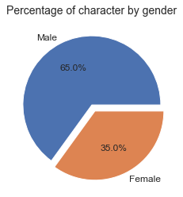
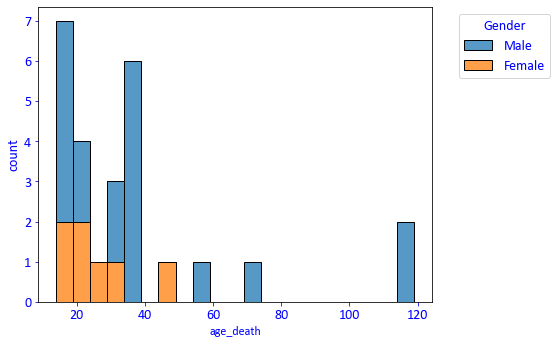

## O quanto você conhece dos personagens de Harry Potter?

  

Ola bruxos e bruxas!

Já pararam para pensar o quanto os dados do universo de Harry Potter pode nos dizer? Com simples perguntas como Qual a quantidade do personagens femininos e masculinos? ou Qual relação de lealdade e casa em Hogwarts?
Essa análise tem como objetivo responder a essas perguntas. Espero que gostem!

No universo de Harry Potter existem aproximadamente 772 personagens de acordo com [wikipedia](https://en.wikipedia.org/wiki/List_of_Harry_Potter_characters), os dados analisados vieram do [kaggle](https://www.kaggle.com/gulsahdemiryurek/harry-potter-dataset), que por sua vez coletou dos sites [pottermore](pottermore.com) e [fandom](https://harrypotter.fandom.com/wiki/Main_Page).
Este dataset contem dados de 140 personagens, o que representa uma amostra de aproximadamente 18%, como o objetivo é conhecer mais detalhes sobre os principais personagens, foi o suficiente.

### Quais perguntas queremos responder?

- How many character by gender?  
- How many caracter by House and Gender?  
- How many caracter by House and Loyalty?  
- How many caracter by House and Blood-Status?  
- How many caracter by Specie and Loyalty?  
- What is the most comoon skill by House?  
- Quantity of Skills x House  
- Distribuition of age death  

#### 1- How many character by gender?

  

#### 2- How many caracter by House and Gender?   

  

 O genero masculino predomina com 65% de participação e feminimo com 35%. Resultado disso, notamos o mesmo cenário quando abrimos por casa em Hogwarts, exceto por  Ravenclaw que apresenta 50% para cada genero.

#### 3-How many caracter by House and Loyalty?

  

Sempre se falou que a maioria dos comensais da morte vieram da Sonserina, e no gráfico de distribuição de lealdade de cada casa confirma exatamente isso, 90.49% dos personagens da Sonserina são comensais da morte. Já na Grifinória, 55.9% são da Ordem da Fenix, 32.4% da Armada de Dumbledore (fundada no 5 livro, a Ordem da Fenix) e também 2.9% de Comensal da Morte: o traidor Peter Pettigrew.
Nota-se um registro de Lord Voldemort estudando na escola Ravenclaw, mas todos sabemos que ele é de Sonserina. Esse é o professor Quirrell, que foi possuído por Lord Voldemor no primeiro livro, a Pedro Filosofal.

#### 4-How many caracter by House and Blood-Status?

  

O blood status sempre foi muito discutido na história, quando se tratava de tradição e poder, uma parte dos personagens se orgulhavam em serem sangue puro e diziam serem melhores que os outros. Aqui vale um teste de hipotese com base no total de skills e/ou morte(novo notebook). 

#### 5-How many caracter by Specie and Loyalty?

  

Ao trazer dados das especies por lealdade, observamos que os humanos são a maioria entre cada lealdade e que para Ordem da Fenix aparecem os Lobisomens, Remus e Bill Weasley e nos Comensais da Morte: O temido Greyback.

##### 6- What is the most comoon skill by House?

- #### Gryffindor

- #### Slytherin

- #### Hufflepuff

- #### Ravenclaw

Para a análise de palavras utilizei NLP (Processamento de língua natural), que nos trouxe seguintes pontos:
Chaser é um skills comuns tanto para Grifinoria quanto para Sonserina, porém vemos animagos apenas para Grifinória, sendo os bruxos Sirius Black, James Potter, Peter Pettigrew e a bruxa e professora Minerva McGonagall com essa habilidade, já na Sonserina, occlumens:
Occlumency was the magic of closing one's mind against Legilimency.
"The magical defence of the mind against external penetration. An obscure branch of magic, but a highly useful one."
  
Na Hufflepuff vemos a palavra food, sabemos que a sala comunal dessa casa fica perto da cozinha em Hogwarts e Helga Hufflepuff, foi muito talentosa em feitiços relacionados à comida e muitas de suas receitas ainda são usadas em Hogwarts. 
Por ultimo Ravenclaw com skill prefect: an older student who is given some authority and helps to control the younger students.

#### 7- Quantity of Skills x House

  

Falando de distribuição e utilizando o gráfico de histograma ao analisar quantidade de skill e casa observamos maior concentração em personagens com apenas 1 skill, sendo que Grifinória aparece com maior quantidade nessa categoria de 1 skill, seguido por Ravenclaw, Sonserina e Hufflepuff.
No canto direito isoloado com 6 skills, Tom Marvolo Riddle,  porém o personagem de Dumbledore traz nessa coluna um único skill: Considered by many to be one of the most powerful wizards of his time. Acho que já diz tudo né?

##### 8- Distribuition of age death

  

Sobre a distribuição de idade de morte os personagens concentram-se abaixo de 40 anos de idade, sendo a maioria masculino mas isso é resultado também de ter mais personagens masculinos. O personagem que morreu mais velho foi Dumbledore, com 116 anos.

#### Conclusão

O universo de Harry Potter tem uma infinidade de possíveis análises, para esta o objetivo foi explorar de uma maneira geral os dados quantitativos e classificatórios.

