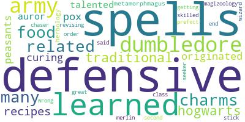
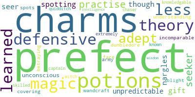

# O quanto você conhece dos personagens de Harry Potter?

  

## Índice

- [Contexto](#Contexto)
- [Quais perguntas queremos responder?](#Quais-perguntas-queremos-responder?)
- [Resultados](#Resultados)

## Contexto
No universo de Harry Potter existem aproximadamente 772 personagens de acordo com [wikipedia](https://en.wikipedia.org/wiki/List_of_Harry_Potter_characters), os dados analisados vieram do [kaggle](https://www.kaggle.com/gulsahdemiryurek/harry-potter-dataset), que por sua vez coletou dos sites [pottermore](pottermore.com) e [fandom](https://harrypotter.fandom.com/wiki/Main_Page).
Este dataset contem dados de 140 personagens, o que representa uma amostra de aproximadamente 18%, como o objetivo é conhecer mais detalhes sobre os principais personagens foi suficiente para os resultados apresentados.

## Quais perguntas queremos responder?

Dessa amostra:
1- Quantos personagens femininos e masculinos?  
2- Quantos personagens femininos e masculinos por escola?  
3- Relação de Loyality x Escola  
4- Relação de Loyality x Species  
5- Qual skill mais comum por escola?  
6- Quantidade de Skills x House  
7- Quantidade de Skills x Blood Status  
8- Quantidade de Skills x Loyalty  
9- Média de idade morte x quantidade de skills  
10- Quantidade de ancestry por Escola  

## Resultados

1- Quantos personagens femininos e masculinos?

 

2- Quantos personagens femininos e masculinos por escola?  
 

3- Relação de Loyality x Escola  
 

4- Relação de Loyality x Species  
 

5- Qual skill mais comum por escola?  

#### Gryffindor

#### Slytherin

#### Hufflepuff

#### Ravenclaw

6- Quantidade de Skills x House  
 

 

8- Quantidade de Skills x Blood Status  
 

9- Quantidade de Skills x Loyalty  
 