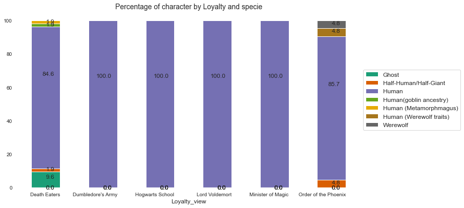
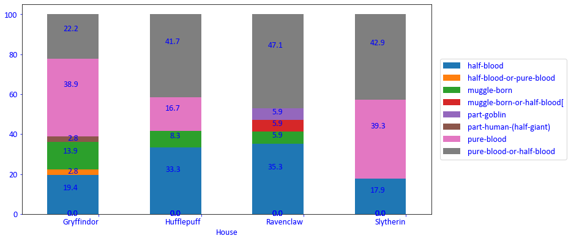
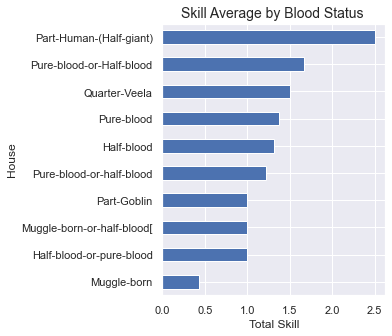

# O quanto você conhece dos personagens de Harry Potter?

  

## Índice

- [Contexto](#Contexto)
- [Quais perguntas queremos responder?](#Quais-perguntas-queremos-responder?)
- [Gráficos](#Resultados)
- [Conclusões](#Conclusões)

## Contexto
No universo de Harry Potter existem aproximadamente 772 personagens de acordo com [wikipedia](https://en.wikipedia.org/wiki/List_of_Harry_Potter_characters), os dados analisados vieram do [kaggle](https://www.kaggle.com/gulsahdemiryurek/harry-potter-dataset), que por sua vez coletou dos sites [pottermore](pottermore.com) e [fandom](https://harrypotter.fandom.com/wiki/Main_Page).
Este dataset contem dados de 140 personagens, o que representa uma amostra de aproximadamente 18%, como o objetivo é conhecer mais detalhes sobre os principais personagens foi suficiente para os resultados apresentados.

## Quais perguntas queremos responder?

Dessa amostra:  
1- How many character by gender?  
2-How many caracter by House and Gender?  
3-How many caracter by House and Loyalty?  
4-How many caracter by House and Blood-Status?  
5-How many caracter by Specie and Loyalty?  
6- What is the most comoon skill by House?  
7- Quantity of Skills x House  
8- Quantity of Skills x Blood Status  
9- Quantity of Skills x Loyalty  
10- Distribuition of age death  

## Gráficos

1- How many character by gender?

 

2-How many caracter by House and Gender?   
 

3-How many caracter by House and Loyalty?   
 

4-How many caracter by House and Blood-Status?  
 

5-How many caracter by Specie and Loyalty?  
 

6- What is the most comoon skill by House?  

#### Gryffindor

#### Slytherin

#### Hufflepuff

#### Ravenclaw

7- Quantity of Skills x House  
 

8- Quantity of Skills x Blood Status  
 

8- Quantity of Skills x Blood Status  
 

9- Quantity of Skills x Loyalty  
 

10- Distribuition of age death  
 

## Conclusão

Através dos gráficos percebemos que entre os personagens, o genero masculino predomina com 65% de participação e feminimo com 35%. Resultado disso, notamos o mesmo cenário quando abrimos por casa em Hogwarts, exceto por  Ravenclaw que apresenta 50% para cada genero.

Sempre se falou que maioria dos comensais da morte vieram da Sonserina, e no gráfico de distribuição de lealdade de cada casa confirmamos exatamente isso, 90.49% dos personagens da Sonserina são comensais da morte. Já na Grifinória, 55.9% são da Ordem da Fenix, 32.4% da Armada de Dumbledore (fundada no 5 livro, a Ordem da Fenix) e também 2.9% de Comensal da Morte: Peter Pettigrew.
Nota-se um registro de Lord Voldemort estudando na escola Ravenclaw, mas todos sabemos que ele é de Sonserina. Esse é o professor Quirrell, que foi possuido por Lord Voldemor no primeiro livro, a Pedro Filosofal.

O blood status sempre foi muito discutido na história, quando se tratava de tradição e poder, uma parte dos personagens se orgulhava de ser sangue puro e diziam serem melhores que os outros. Aqui vale um teste de hipotese (novo notebook). 

Ao trazer dados das especies por lealdade, observamos que os humanos são a maioria entre cada lealdade e que para Ordem da Fenix aparecem os Lobisomens, Remus e Bill Weasley e nos Comensais da Morte: O temido Greyback.

Para a análise de palavras utilizei nlp, o que nos trouxe seguintes pontos:
Chaser é um skills comuns tanto para Grifinoria quanto para Sonserina, porém vemos animagos apenas para Grifinória, sendo os bruxos Sirius Black, James Potter, Peter Pettigrew e a bruxa e professora Minerva McGonagall com essa habilidade, e na Sonserina, occlumens:
Occlumency was the magic of closing one's mind against Legilimency.
"The magical defence of the mind against external penetration. An obscure branch of magic, but a highly useful one."
  
Na Hufflepuff vemos a palavra food, sabemos que a sala comunal dessa casa fica perto da cozinha em Hogwarts e Helga Hufflepuff, foi muito talentosa em feitiços relacionados à comida e muitas de suas receitas ainda são usadas em Hogwarts. E por ultimo Ravenclaw com skill prefect: an older student who is given some authority and helps to control the younger students.

O universo de Harry Potter tem uma infinidade de possíveis análises, para essa análise o objetivo foi explorar de uma maneira geral os dados quantitativos e classificatórios.
