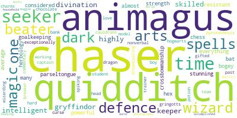
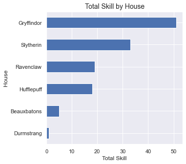
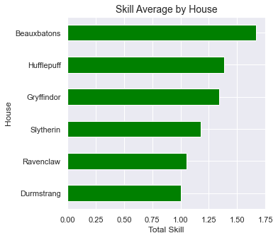

# How much do you know about the characters from Harry Potter?

  

## Index

- [Context](#Context)
- [Which questions do we want to respond to?](#Context)
- [Results](#Results)

## Context
There are approximately 772 caracteres in the universe of Harry Potter acording to [wikipedia](https://en.wikipedia.org/wiki/List_of_Harry_Potter_characters), the data analyzes came from [kaggle](https://www.kaggle.com/gulsahdemiryurek/harry-potter-dataset), which in turn collected from the websites [pottermore](pottermore.com) e [fandom](https://harrypotter.fandom.com/wiki/Main_Page).
This dataset contains data of 140 characters, which represent one sample of about 18%, the objective is to know more details about the main characters, so was enough for this analysis.

## Which questions do we want to respond to?

1- How many female and male characters?  
2- How many characters by house?  
3- Relation of Loyalty x House  
4- Relation of Loyalty x Species  
5- What is the most common skill by house?  
6- Total Skills by House  
7- Skill Average by House  
7- Skill Average by Blood Status  
8- Skill Average by Loyalty  

## Results

1- How many female and male characters?

 

2- How many characters by house?  
 

3- Relation of Loyality x House  
 

- I don't know about you, but I was impressed by how many Death Eater is, Gryffindor and Hufflepuff present the lower percentage.

4- Relation of Loyality x Species  
 

5- What is the comoon skill for each school?  

#### Gryffindor

#### Slytherin

#### Hufflepuff

#### Ravenclaw

6- Total Skills by House  
 

 

- In terms of quantity Gryffindor has the greater result, but on the other hand, looking at the average we can see that Beauxbaton is bigger.

 

7- Total Skills by Blood Status  
 

8- Total Skills by Loyalty  
 

### Hope you liked it!, Bye ;)

  

